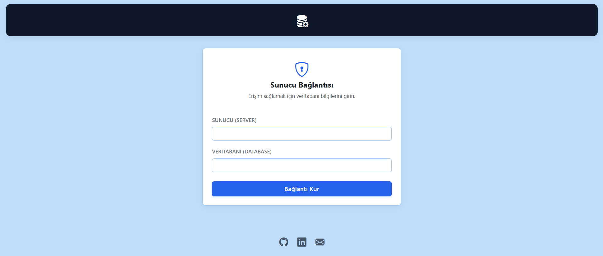
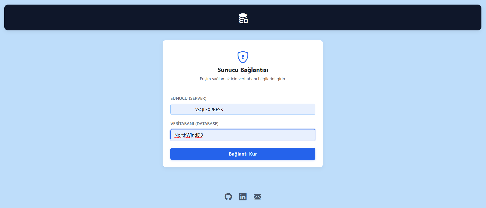
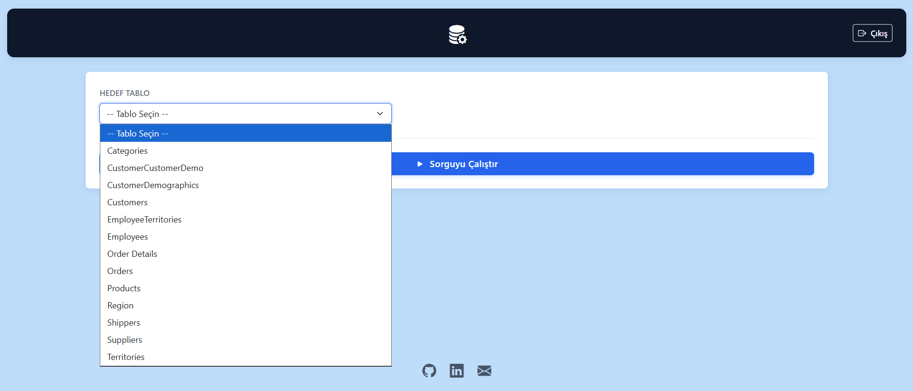
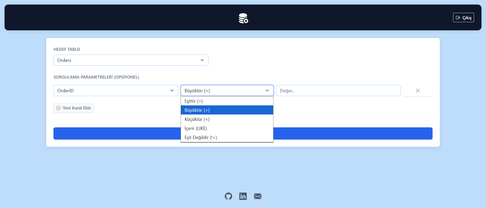
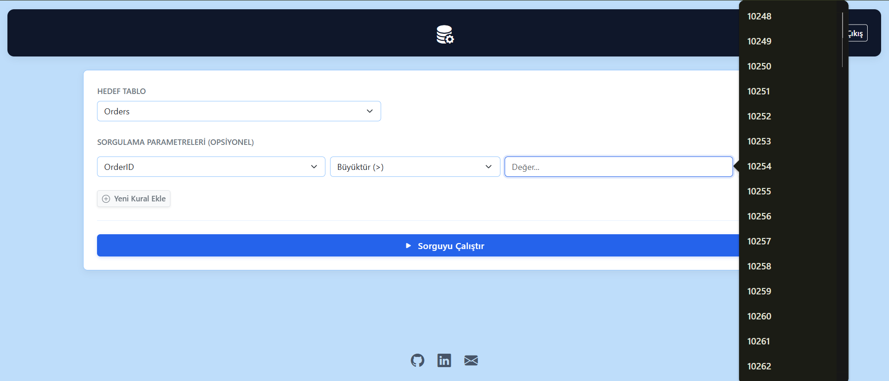
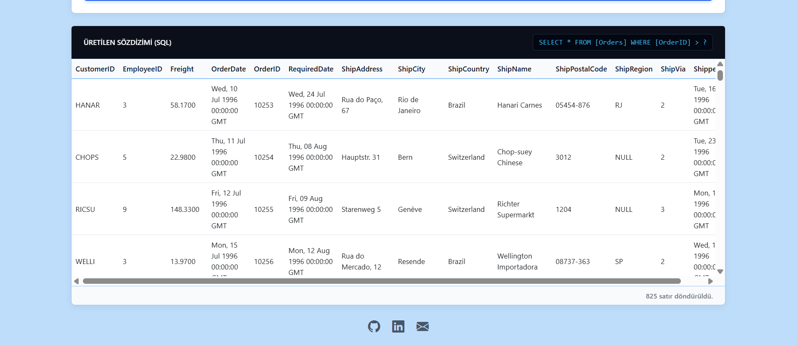

# SQL_automation
Python ve Flask kullanılarak geliştirilmiş, görsel arayüz üzerinden güvenli MSSQL sorgu otomasyonu uygulaması.

# 🚀 SQL Sorgu Otomasyonu

Kullanıcıların SQL sözdizimi yazmasına gerek kalmadan, MS SQL Server veritabanlarına bağlanarak dinamik filtreleme ve sorgulama yapmasını sağlayan web tabanlı bir araçtır. 

## 🛠️ Kullanılan Araçlar ve Teknolojiler

*   **Backend:** Python, Flask
*   **Veritabanı Sürücüsü:** pyodbc, MS SQL Server
*   **Frontend:** HTML5, CSS3, Vanilla JavaScript, Bootstrap 5
*   **Güvenlik:** Parametrik SQL Sorguları (SQL Injection koruması), OS Urandom (Oturum şifreleme)

## 🧠 Geliştirme Süreci ve Alınan Kararlar

Proje, manuel veritabanı işlemlerini otomatize etmek ve son kullanıcı için görselleştirilmiş bir sorgu ekranı sunmak amacıyla geliştirilmiştir. Süreç şu mimari kararlar doğrultusunda ilerlemiştir:

**1. Mimari Yaklaşım (API Tabanlı İletişim)**:
Sayfa yenilenmesinin önüne geçmek ve daha akıcı bir kullanıcı deneyimi sunmak için sistem REST-benzeri bir yapıda tasarlandı. Frontend, veritabanı şemasını (`/api/schema`), sütun değerlerini (`/api/values`) ve sorgu sonuçlarını (`/api/execute`) arka plandaki Python sunucusundan asenkron (`fetch`) olarak çeker.

**2. Backend ve Sürücü Tercihi**:
Sunucu altyapısı için hafif ve esnek olması sebebiyle **Flask** tercih edildi. MS SQL Server ile iletişim kurmak için **pyodbc** kütüphanesi kullanıldı. Kullanıcı adı ve şifre zorunluluğunu ortadan kaldırmak için Windows Kimlik Doğrulaması (`Trusted_Connection=yes`) mekanizması entegre edildi. Bağlantı bilgileri `session` içerisinde tutularak sistemin çoklu sekme veya sayfa geçişlerinde bağlantıyı hatırlaması sağlandı.

**3. Dinamik Şema Okuma**:
Kullanıcının veritabanını bilmesine gerek kalmadan işlem yapabilmesi için, sunucuya bağlanıldığı an `INFORMATION_SCHEMA` tabloları üzerinden veritabanındaki tüm "BASE TABLE" kayıtları ve bu tablolara ait sütunlar okunarak bir JSON haritası (sözlük) oluşturuldu.

**4. Akıllı Otomatik Tamamlama (Datalist)**:
Filtreleme esnasında kullanıcı deneyimini artırmak için, seçilen sütundaki mevcut verilerin çekilmesine karar verildi. Sistemin yorulmaması ve verilerin tekrar etmemesi için `SELECT DISTINCT TOP 100` sorgusu ile benzersiz veriler çekilerek frontend tarafındaki `<datalist>` etiketlerine dinamik olarak eklendi.

**5. Güvenlik ve Parametrik Sorgular**:
Kullanıcıdan alınan verilerin doğrudan SQL stringine birleştirilmesi ciddi güvenlik zafiyetleri (SQL Injection) doğurur. Bu nedenle backend tarafında filtre değerleri sorgu metnine gömülmedi, `?` yer tutucuları (placeholder) ve `params` listesi kullanılarak sorgular veritabanına güvenli bir biçimde iletildi. Ayrıca byte formatındaki veriler (örn. resimler) `<Binary Veri>` stringine dönüştürülerek sistemin çökmesi engellendi.

**6. Frontend ve UI Tasarımı**:
Kullanıcı arayüzünde temiz ve kurumsal bir görünüm elde etmek için **Bootstrap 5** grid sistemi kullanıldı. Ağır frameworkler yerine Vanilla JS ile DOM manipülasyonu yapıldı. Tasarımda görsel karmaşayı önlemek için hover efektleri, sabit gölgelendirmeler ve belirgin hiyerarşik renk paleti (Koyu Lacivert ve Kurumsal Mavi) özel CSS ile kodlandı.

## 📸 Ekran Görüntüleri

Aşağıda uygulamanın kullanım akışını gösteren ekran görüntüleri yer almaktadır:













## 💻 Kurulum ve Çalıştırma

1. Gerekli Python kütüphanelerini yükleyin:
   ```bash
   pip install flask pyodbc

2. Uygulamayı başlatın:
Bash
python app.py

3. Tarayıcınızdan terminal üzerinde çıkan adrese giderek arayüze erişin.


## 👨‍💻 Geliştirici
**[Meriç Akman](https://github.com/MericAkman)**
